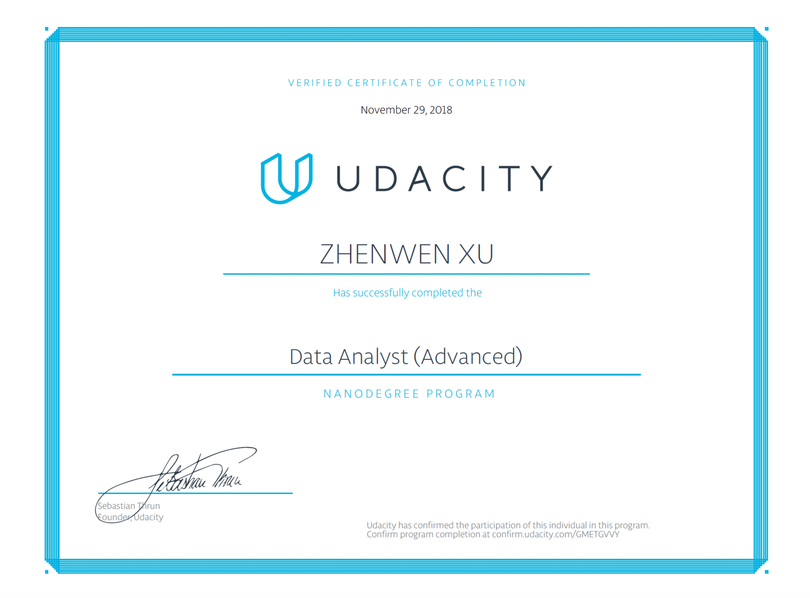
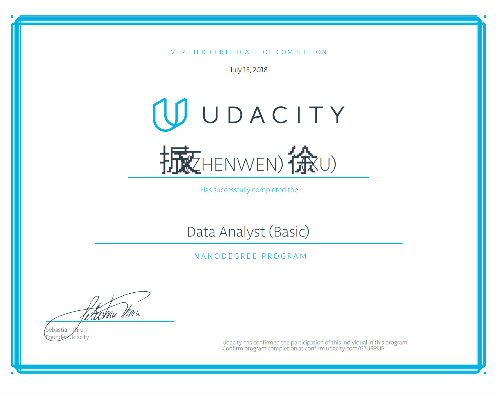
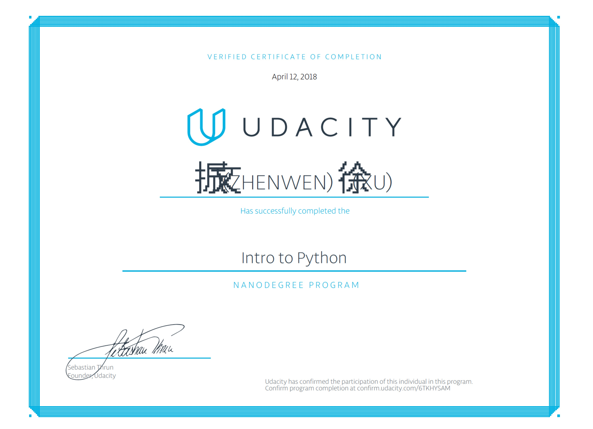

# Udacity Projects of Zhenwen Xu
This is a repository which includes all files of projects in the `NanoDegree of Data Analyst(Advanced)`, `NanoDegree of Data Analyst(Basic)`, and `NanoDegree of Intro to Python`. And all this files belongs to `Zhenwen Xu`.

## About Author
First name: `Zhenwen`  
Last name: `Xu`  
Sex: `Male`  
E-mail: <xzw6jp@gmail.com>    
LinkedIn: <https://www.linkedin.com/in/zhenwen-xu-527757156/>    

## Certification of NanoDegree of Data Analyst(Advanced)

## Introduction of NanoDegree of Data Analyst(Advanced)
This course has five main chapter, which are Welcome chapter, Basic Analysis in Python, Data Wrangling, Exploratory Data Analysis, and Data Story Telling.
Each chapter includes a mini project, and I list them in the following:
1. Game of Thrones Battle Analysis
2. Test a Perceptual Phenomenon
3. Data Wrangling WeRateDogs
4. Exploratory of Red Wine's Quality
5. Tableau Story about Titanic Dataset

## Certification of NanoDegree of Data Analyst(Basic)

## Introduction of NanoDegree of Data Analyst(Basic)
This course has four main chapter, which are Welcome chapter, Introduction to Python, Introduction to Data Analysis, and Practical Statistics.
Each chapter includes a mini project, and I list them in the following:
1. Explore Weather Trends
2. Explore Data of Shared Bike in the USA
3. Investigate a Dataset
4. Analyze A/B Test Results

## Certification of NanoDegree of Intro to Python

## Introduction of NanoDegree of Intro to Python
This course includes two parts, which are Python Syntax and Crawl Douban Movie Info.
Python Syntax contains a mini project called Investigating phones calls and texts, which are four tasks involved using many basic Syntax of Python to achieve some functions.
Crawl Douban Movie Info is a name of project, which requires to collect data from website by using script and do some simple analysis.
